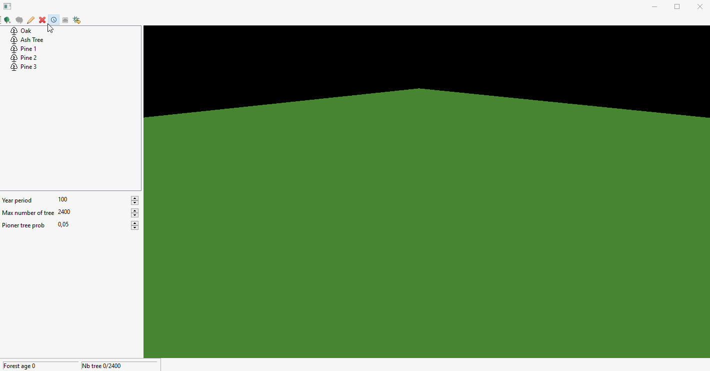

= Forest Simulation

== Context

Forest Simulation is a sample application that tries to demonstrate how a 3D application
can be built using Eclipse RCP + link:https://www.eclipse.org/modeling/emf/[EMF] + link:https://jmonkeyengine.org/[JMonkey].

It has been used as a support for EclipseCon 2020 for the talk link:https://www.eclipsecon.org/2020/sessions/lifting-15-tons-blocks-eclipse[Lifting 15 tons blocks with Eclipse].  

== Purpose

The application aims to create simulations of how a forest grow by modeling tree interactions.

The types of tree are (at the moment) link:https://github.com/ObeoNetwork/ForestSimulation/blob/ab9c2967157e00d64e1bff43e5b699a484f92258/fr.obeo.forestsimulation.rcp/src/fr/obeo/forestsimulation/rcp/Session.java#L76[hard coded].

Then the simulation relies on several properties editable in the application:

* Maximum number of trees
* Matching year period (speed of the emulation)
* Several probabilities:
** Child tree
** Pioneer tree creation
** Health/Sick probability
* And many others

== Build & IDE

Build and test _mvn clean verify_ in folder _fr.obeo.forestsimulation.parent_

In order to make the project compile in Eclipse you need to compile the project at least once with Maven to download the required dependencies.

== Demo

